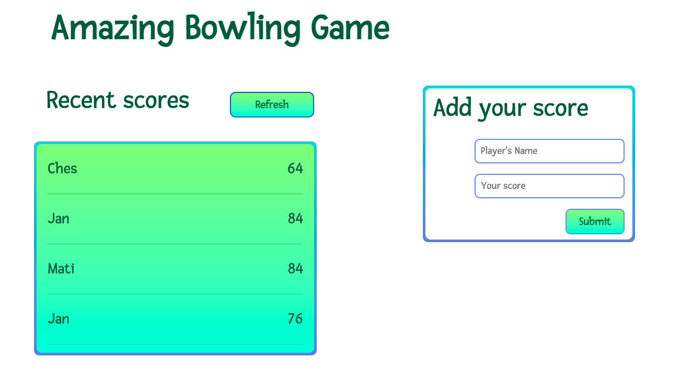

## Leaderboard

> Webpack Implementation.

### Milestone 1:
 - Setup webpack
 - Created a plain HTML markup with minimum styling
 - Added JavaScript modules with import and export
### Milestone 2:
- Created new game using the API
- Added functionality to refresh button
- Added functionality for add new score with the form
- Used async functions and await
### Milestone 3:
- Added some classes into index.html for styling
- Added selectors to style.css
 
## Built With

- HTML, CSS & JS
- Visual Studio Code
- Webpack
- Linters
## Live demo
https://alexrs90.github.io/liderboard/dist

## Set up locally

- Open your terminal and run the following command: git clone https://github.com/AlexRS90/liderboard.git
- Run the command "npm install"
- Run the command "npm run build"
- Run the command "npm run start"

Once you completed this steps you should see the app running at: http://localhost:8080/ in your browser.

## Author 👤

👤 **Alejandro Ramos**

- GitHub: [@githubhandle](https://github.com/AlexRS90)
- Twitter: [@twitterhandle](https://twitter.com/AlejandroRBenji)
- LinkedIn: [LinkedIn](https://www.linkedin.com/in/alejandro-ramos-santos-9b0b52135/)

## 🤝 Contributing

Contributions, issues, and feature requests are welcome!

Feel free to check the [issues page](https://github.com/AlexRS90/liderboard/issues)

## Show your support

Give a ⭐️ if you like this project!

## Acknowledgments

- Hat tip to anyone whose code was used
- Inspiration
- etc